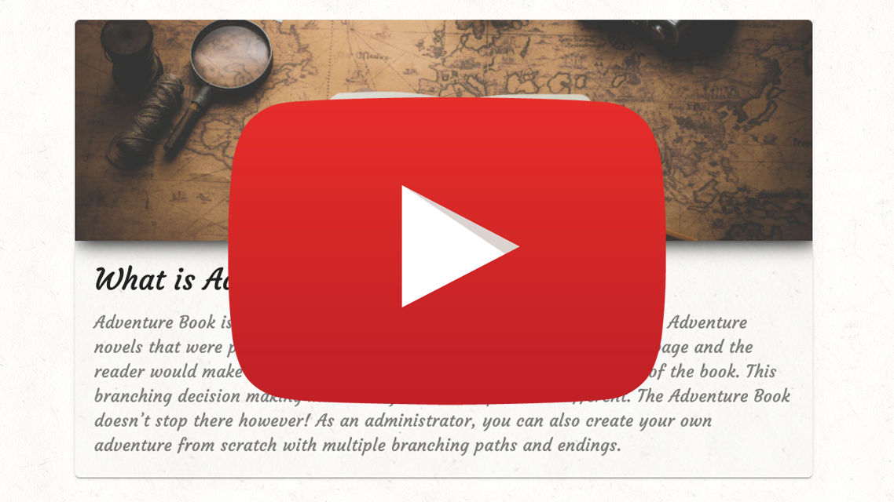
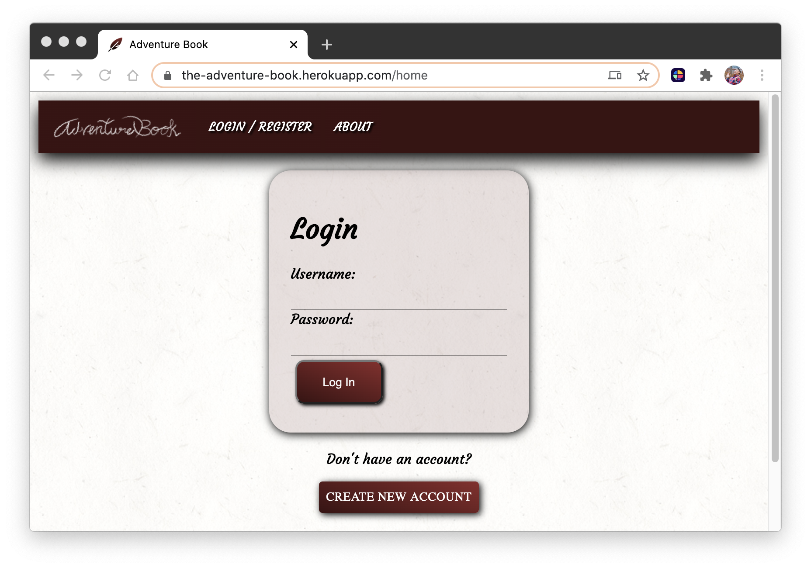
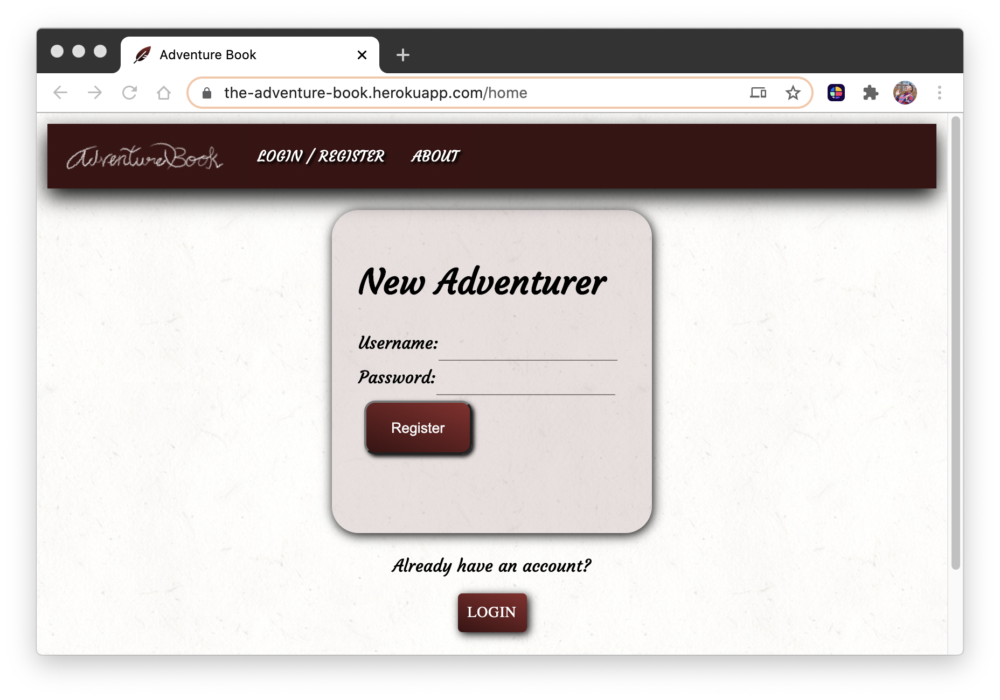
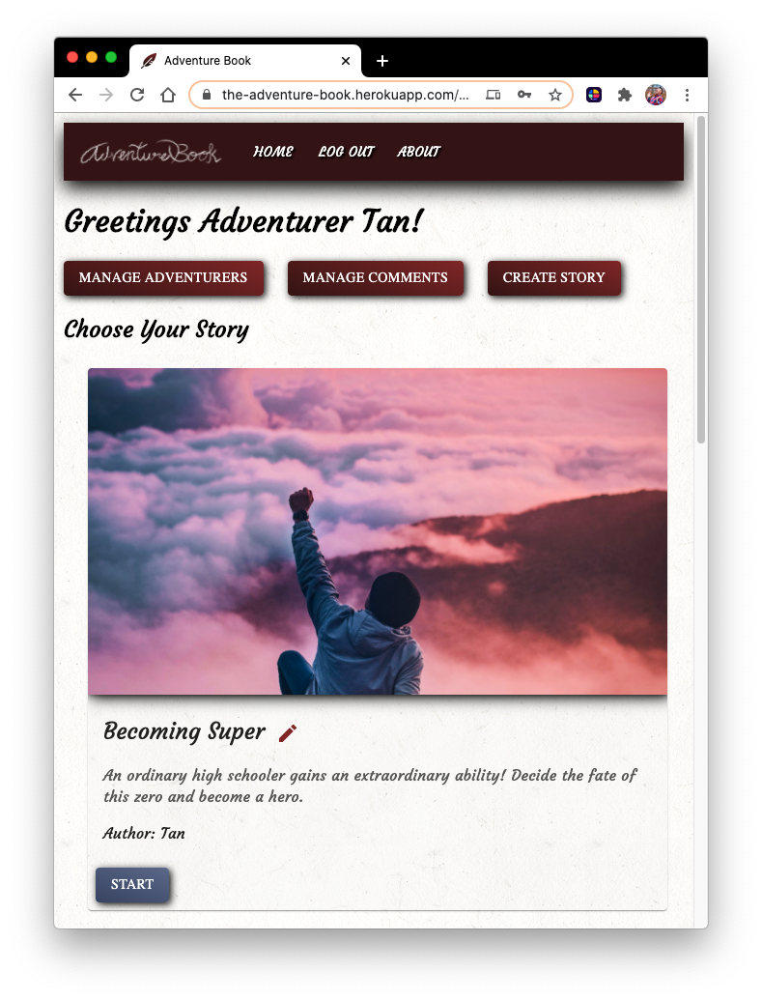
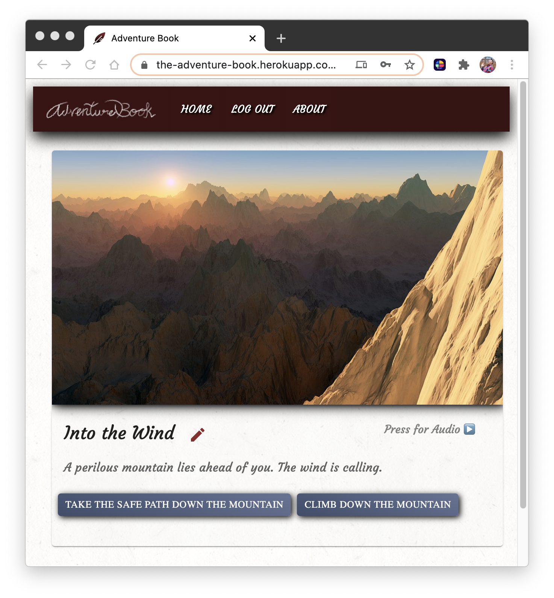

# 

>by Tan Van Nguyen

>Project Scoping Date: May 18th, 2020
>Project Completion Date: June 8th, 2020

>Technologies Utilized: 
```PostgreSQL, Express, React.JS, Node.JS, HTML5, CSS, Material UI```

## Project Summary
- The **Adventure Book** is aimed to fully realize the joys of the *Choose Your Own Adventure* novels that were popular in the 90’s.  These novels often started on one page and the reader would make decisions that would take them to a different page of the book.  This branching decision making made every reader’s experience different.  The *Adventure Book* doesn’t stop there however!  As an administrator, you can also create your own adventure from scratch with multiple branching paths and endings.

## Video Example
- A short video demonstrating Adventure Book after the two week sprint.
[](https://youtu.be/1Vm5sj3crUo)

## Application Deep Dive

### Login Page
- Every person who visits the Adventure Book is an **adventurer**!  Adventurers can start by creating their account at the login page.  Depending on the login, each adventurer's access determines which view they will see; an **administrator** or **standard** view.  Upon login, administrators have access to view all adventurers in a list and grant administrator access if necessary.




### Standard View
- Adventurers can login, choose a story, and make decisions in various branching *snippets* to reach an *ending*.  Once the adventurer has reached an *ending*, they can post a comment and view previous comments on that ending.

### Administrator View
- Administrator access ramps up the fun!  Adventurers with *administrator* access will have the ability to create brand new *stories* & *snippets*.  They can also make changes to existing *stories* & *snippets*.  Administrators can delete comments left by adventurers on *ending* pages.  Stories will list which administrator created them.

## Components

#### Stories 
- A **story** has a title, description, and picture.  They can contain multiple *snippets*.  Administrators can create, update, and delete *stories*.  A list of all stories can be found on the landing page.



#### Snippets
- A **snippet** has a title, description, a picture, and a list of all the other *snippets* which are linked together.  Each *snippet* has an *ending* BOOLEAN option.  If ending is set to TRUE will allow adventurers to post a comment and view previous comments.  If FALSE, will allow Administrators to add more actions and child snippets.  As with *stories*, administrators can create, update, and delete *snippets*.  Snippets can be read aloud using Text-to-Speech API by pressing the Play icon.



## Database

### Main Tables

- The **Adventurer** table has a list of adventurers and encrypted passwords.  These adventurers can have administrator access which conditionally determines what they see.

- The **Story** table is the first thing that adventurers see upon login.  Choosing a story will display snippets.  Each snippet is connected to a story.

- The **Snippet** table is a list of all the snippets of a story.  An *ending* type of TRUE can have comments posted on them by adventurers.

### Miscellaneous Tables

- The **Snippet_Chain** table is responsible for setting the relationship between the various *snippets*.  Junctions will also contain actions which describe the linking action between the two snippets.  Example: *Open the front door*.

- The **Comment** table connects an adventurer to a snippet along with a comment and date posted.  Adventuers can post comments on ending snippets and view other comments as well.

- The **Author** table determines which administrator created which story.

[](https://dbdesigner.page.link/TXqVPfzEwVwzTyp66)

## Upcoming Features

#### Uppy
- *Uppy* will allow administrators to upload images online from popular sites such as Facebook, Instagram, Dropbox, or even their local computer.  *Uppy* will then provide a URL that administrators can use for their stories and snippets.

#### CSS Customization
- Administrators will be able to modify CSS elements of a *story*.  Some examples of CSS elements they can modify would be font size, font family, text and background color.

#### Google Fonts
- *Google Font API* will allow administrators to set the font of each story which can drastically change the tone of a page and allow greater access to fonts available on the Internet.

#### More Statistics
- When an adventurer reaches an *ending* they will see additional details in a graph that displays how many other adventurers have landed on the same page. 

#### Obtainable Items
 - This will allow adventurers to obtain items such as a key which can unlock snippets that were not available to the adventurer previously.  These will be stored in the database for the current playthrough.

## Scoping Wireframe Example
- A full overview image of the Adventure Book.  Utilize your browser's zoom feature or click the image for a larger view.

